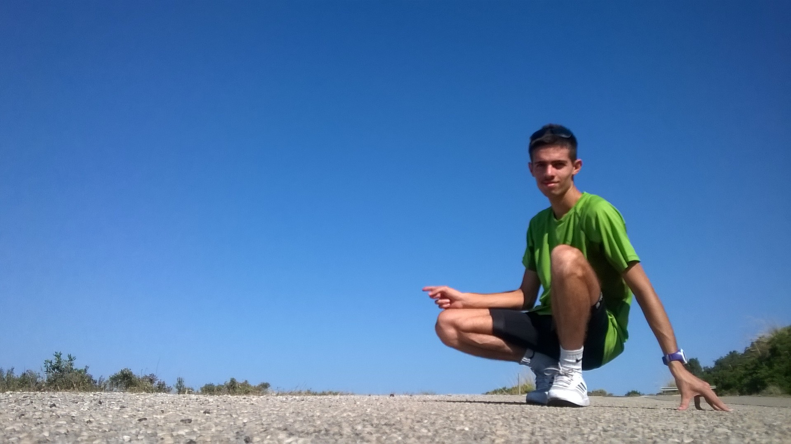

<html>
<head>
<meta name="viewport" content="width=device-width, initial-scale=1">

</head>
<body>

<!-- originaL style="width:100%; height:50%" -->

  
  

 Instinct choices, Rationality follows 

</body>
</html> 

## A taekwondoka turned endurance athlete

I started this long sport journey thanks to my swimming classes in my childohood, together with what I consider the first milestone of my life: **my taekwondo learning path**. 
I joined several tournaments, met a lot of friends and expecially, I started to understand how my body works, and changing my introvert nature. The dark belt (first DAN) is one of the last things of that experience, and I still feel today a strong pride and emotions when I wear it. I will come back one day.

After two parenthesis in tennis, I started competing again in mountain-bike in 2017-2018, running (2018-present), and road cycling (2021-present). 
And from 2024 I started duathlons as well. It seems the most promising one, at least for me. I have won a national age-group championship in Imola, on April 2025. This deserves a dedicated blog post, for all the months full of emotions and fear that lead me to that. 
I think my athletic history is much more behind other areas of my life, even if it seems I train a lot from outside. I do. But it's still a pretty recent thing, and my passions have not yet converged towards a clear goal. For this reason I keep exploring. 
***My athletic and engineering achievments are not only selfish results, but I want to spread information and consciousness about life as a student-athlete, both for future students and current success stories. I share my story because every path towards excellence is paved of hard lessons learnt, emotions and people. Expecially people***. 

  
  
  
  

Aside from that, I think sport is also about exploration, other than competition. And biking around really helps me connecting more with the territory I live in.

  
  
  
  

## My results highlights

🚴‍♂️Road Cycling: competing for an amatorial Italian cycling team (Team MP Filtri). 
- **4th** at National University Championships (CNU), Camerino, 2023. [official results](/files/CLASSIFICA-CNU.pdf)
- **7th (4th Italian)**  UCI Granfondo World Championships (side event), Uphill Time Trial "Charly Gaul", Monte Bondone, Trento, 2022. [results](https://www.endu.net/it/events/cronoscalata-charly-gaul-monte-bondone/results)

🏃‍♂️Road Runner:
    - Memorial Fava: 8th (2022), 16th (8th Italian) (2019) + won a small local race, La Pasqualonga, in 2019🙂. My first victory.
    - 10 km time: **34:43**, Duathlon Classic Italian Championships 2024 ([results](https://www.endu.net/it/events/campionato-italiano-duathlon-classico-no-draft-quinzano/results))
    - 5km time: **15:53**, Duathlon Sprint Italian Championships 2025 ([time](https://www.endu.net/it/events/campionato-italiano-duathon-sprint-assoluto-u23-agegroup-paraduathlon-coppacrono-imola/results))

🥋Taekwondo: **black belt** + several podiums at inter-regional youth competitions

🏊‍♂️‍➡️🚴‍♂️➡️🏃‍♂️Triathlon. **4th** at Duathlon Sprint Italian Championships (Age Group) Imola, 2025 + **italian champion Age Group 25-29** ([results](https://www.fitri.it/it/news/fitri/1159-terzo-piano/20323-podi-e-classifiche-age-group-dei-campionati-italiani-duathlon-sprint-imola-2025.html))

